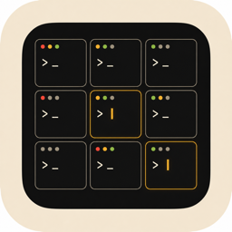

<p align="center">
  
</p>

<h1 align="center">ClaudeDock</h1>

<p align="center">
  <em>macOS menu-bar app for managing multiple concurrent Claude Code sessions</em>
</p>

ClaudeDock aggregates the live state of every running `claude` session and lets you jump back to the right terminal with one click. It plugs into Claude Code through the **official plugin marketplace** — your `~/.claude/settings.json` is never modified.

## Why

If you run two or three `claude` sessions in parallel across different projects, switching between terminals turns into a tab-hunting exercise. ClaudeDock gives you:

- **One menu-bar icon** showing aggregate status across all sessions (red = needs input, yellow = thinking, green = idle, gray = none).
- **One popover** listing every session with project name, current state, and last-event timestamp.
- **One click** to focus the originating terminal — works precisely for iTerm and Terminal.app; activates the app window for Ghostty / Warp / VS Code / Cursor.

## Features

- **Glanceable status** — tri-color menu-bar icon updates in real time.
- **Notification system** — local sound + optional system banner when a session transitions to `waitingInput` or `idle`. Sound plays via `NSSound` directly so it works even under Focus Mode / Do Not Disturb.
- **Optional flash banner** — opt-in notch dock surface appears for 5s on state transitions; sits flush under the menu bar on non-notched Macs, tucks under the physical notch on notched Macs.
- **Per-session metadata** — alias, color tag, pin via right-click. State persists across launches.
- **Global hotkey** — default ⌥-Space toggles the popover; customizable in Settings.
- **Independence Invariant** — verified at runtime via Settings → Diagnostics → "Run Independence Check". Compares `~/.claude/settings.json` SHA-256 against a captured baseline.
- **First-launch wizard** — 4-step setup (Welcome → Plugin install → Notch Dock optin → Hotkey).
- **Launch at login** — toggleable in Settings → General (uses `SMAppService.mainApp`, no helper bundle).

## Install

### Requirements

- macOS 14 (Sonoma) or later
- Swift 6.0+ — either the standalone toolchain from [swift.org](https://www.swift.org/install/macos/) or Xcode 16+

### Build from source

```bash
git clone https://github.com/qiuruiyu/ClaudeDock.git
cd ClaudeDock
bash Scripts/build-app.sh release
cp -R .build/ClaudeDock.app /Applications/
open /Applications/ClaudeDock.app
```

If you're using the standalone Swift toolchain (no Xcode), the build script automatically sources `Scripts/dev/env.sh` which puts the toolchain on PATH.

### Plugin registration

This repo bundles the Claude Code plugin under [`marketplace/`](marketplace/). From the repo root after cloning, run:

```bash
claude plugin marketplace add "$(pwd)/marketplace"
claude plugin install claudedock@claudedock
```

ClaudeDock.app also regenerates the same plugin files at `~/Library/Application Support/ClaudeDock/marketplace/` on every launch — both paths are functionally identical. The first-launch wizard inside the app surfaces the Application Support path; you can use whichever is convenient.

Once installed, every `claude` session you start will register with ClaudeDock automatically.

## Usage

- **Click the menu-bar icon** → popover opens with the session list
- **Click any session row** → focuses the originating terminal
- **Right-click a session row** → rename, set color tag, pin/unpin, copy cwd, reveal in Finder, forget
- **⌥-Space anywhere** → toggle popover (default — customizable in Settings → Hotkey)
- **⚙ in popover** → Settings (general, notifications, appearance, hotkey, terminal, plugin & hooks, data, diagnostics, about)

## Uninstall

ClaudeDock writes only to `~/Library/Application Support/ClaudeDock/` (its own folder, including the bundled marketplace). Your `~/.claude/settings.json` is never touched directly — all Claude Code integration goes through the official `claude plugin install/uninstall` CLI commands.

Settings → Plugin & Hooks → **Uninstall…** opens a three-step sheet that walks you through:

```bash
# 1. Tell Claude Code to forget the plugin
claude plugin uninstall claudedock@claudedock
claude plugin marketplace remove claudedock

# 2. Delete ClaudeDock's data folder (or use the sheet's button)
rm -rf "$HOME/Library/Application Support/ClaudeDock"

# 3. Trash ClaudeDock.app from /Applications
```

After uninstall, your `~/.claude/settings.json` should be byte-identical to before install. Diagnostics → Run Independence Check verifies this on demand.

## Architecture

Single-process macOS LSUIElement app (no Dock icon).

```
┌─────────────────────────────────────────────────────────┐
│ ClaudeDock.app                                          │
│                                                         │
│   NSStatusItem ──── NSPopover ──── SwiftUI session list │
│        │                                                │
│        ▼                                                │
│   SessionStore (@MainActor ObservableObject)            │
│        ▲                                                │
│        │                                                │
│   HookServer (swift-nio actor, 127.0.0.1:random)        │
│        ▲                                                │
└────────┼────────────────────────────────────────────────┘
         │  HTTP POST per hook event (5 kinds, never high-frequency)
         │
   ┌─────┴────────────────────────────────────┐
   │ Claude Code plugin at                    │
   │ ~/Library/Application Support/ClaudeDock │
   │ /marketplace/claudedock/                 │
   └──────────────────────────────────────────┘
```

State is fused from three sources: **hook events** (highest authority), **process heartbeat**, and **transcript file mtime** (escalate-only-to-ended). See `Sources/ClaudeDock/Core/StatusEngine.swift` and `Sources/ClaudeDock/Core/SessionStore.swift`.

Plugin manifest is regenerated at app launch (`Sources/ClaudeDock/Hook/PluginManager.swift`) so the hook script is always in sync with the installed app.

## Tests

```bash
source Scripts/dev/env.sh && swift test
```

95 swift-testing expectations across 26 suites. Includes unit coverage for identity synthesis, status engine, plugin manifest builder, the notch dock state machine, and `SessionStore.forget` semantics.

## License

[MIT](LICENSE) © joseph
